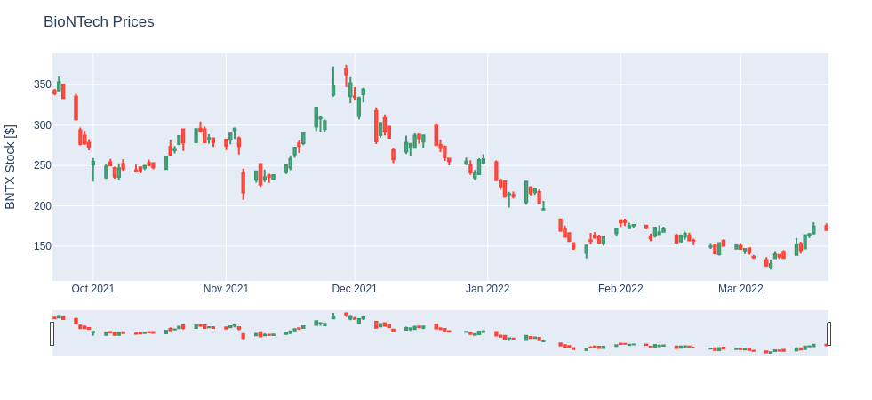
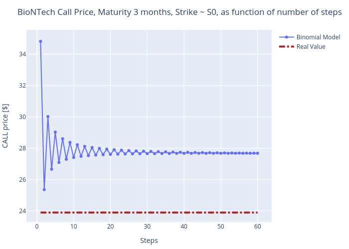

# Pricing a Call Option with the Binomial Model

I priced a Call Option using the Binomial Model.

Three different computations were made:

    - pricing a Google option with maturity 3 months
    - pricing a BioNTech option with maturity 3 months
    - pricing a BioNTech option with maturity 6 months

Here the last 3 months prices of Google stocks:

Here the last 6 months prices of BioNTech stocks:

I computed the output of the Binomial Tree Model using different steps and I obtained the following, respectively for the Google and the BioNTech (3 and 6 months) call options:

